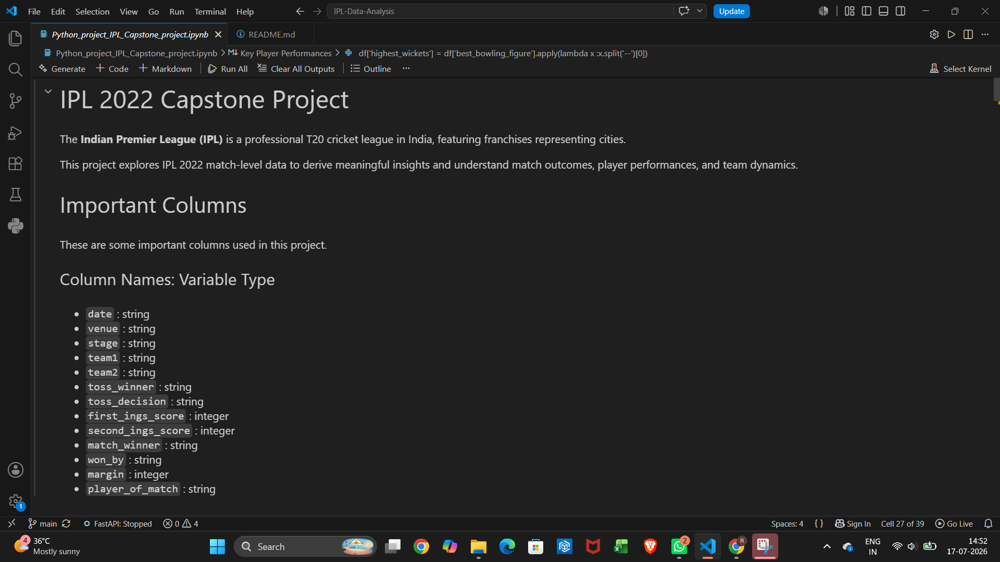
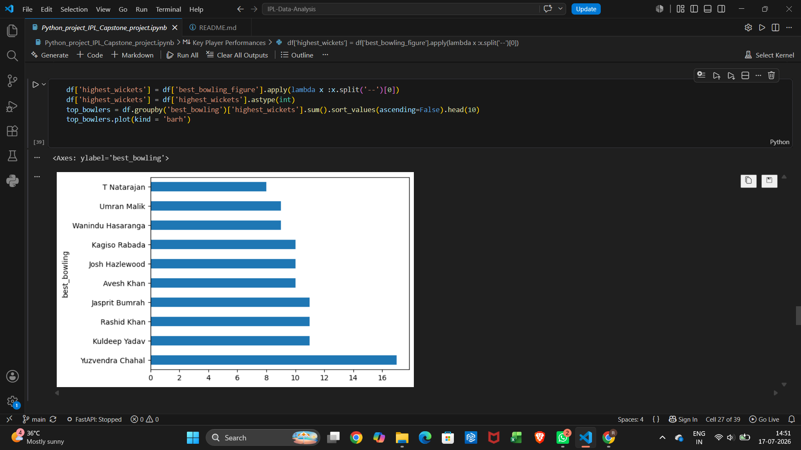

# 🏏 IPL 2022 Data Analysis

### 📊 Exploratory Data Analysis (EDA) on IPL 2022 using Python & Jupyter Notebook

---

## 📸 Project Preview

### IPL Data Visualization
### Team Performance Analysis  

---

## 📌 Project Overview

This project performs Exploratory Data Analysis (EDA) on the IPL 2022 dataset to discover meaningful insights about teams, players, match results, batting performance, bowling performance, and tournament statistics.

The analysis is performed using Python libraries inside a Jupyter Notebook.

---

## 📂 Files
🔀 Minor README update.